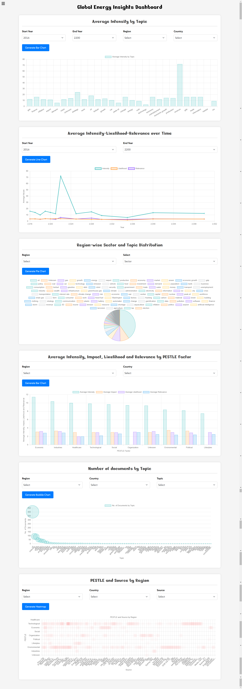

# Global Energy Insights Dashboard

This project is a data visualization dashboard that uses Chart.js to create interactive visualizations for analyzing multiple factors. The dashboard includes various charts such as **Bar Chart, Line Chart, Pie Chart, Bubble Chart, Heatmap**, with filtering options for regions, years, and other metrics. The visualizations work with a sample data set of 1000 documents.

### Technologies Used

- Front-end: Bootstrap, HTML, CSS, JavaScript
- Charting Library: Chart.js
- Back-end: Node.js
- Database: MongoDB (NoSQL)

### Please Note

- This project is done as an assignment.
- The data used is available publicly.

### Screenshot

### About me

You can learn more about me and explore my other projects on my [personal portfolio website](https://siddheshmestri.online).
